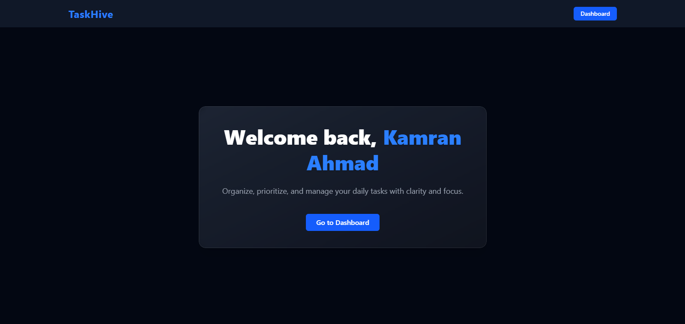
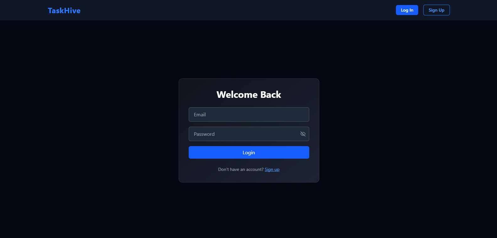
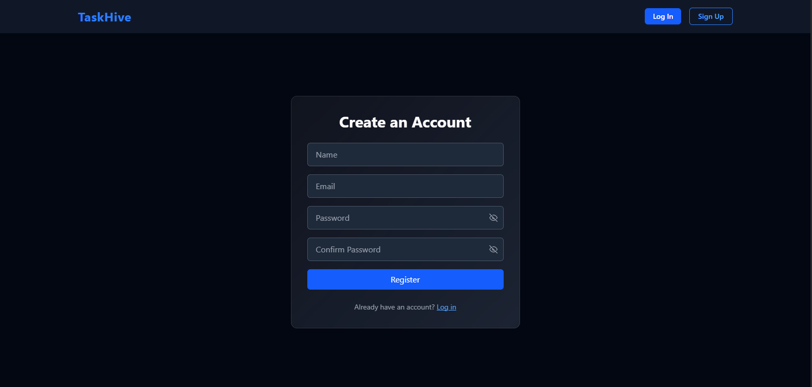
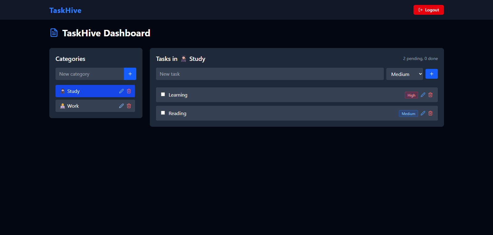

# ✅ TaskHive 🐝 – A Full-Stack Productivity App

**TaskHive** is a category-based task management application built with the **MERN** (MongoDB, Express, React, Node.js) stack. It helps users organize their tasks, assign priority, and manage daily productivity in an intuitive, dark-themed dashboard.

---

## 📸 Project Showcase

| Home Page | Login Page | Registration Page | Dashboard |
|-----------|------------|-------------------|-----------|
|  |  |  |  |

---

## 🚀 Features

- 🔐 User authentication with JWT (Login/Register)
- 🎨 Dark-themed and responsive UI
- 🗂️ Create, update, delete task categories
- 📝 Add, edit, delete tasks under categories
- ⏫ Set priority: Low, Medium, High
- ✅ Mark tasks as complete/incomplete
- 🔁 State management using React Context
- 🌐 Toast notifications for all actions
- 📱 Fully mobile responsive

---

## 🧱 Tech Stack

### Frontend:
- ⚛️ React + Vite
- 💨 Tailwind CSS
- 🔁 React Router DOM
- ✅ React Hook Form + Yup
- 🍞 React Hot Toast
- 📡 Axios

### Backend:
- ⚙️ Node.js + Express
- 🧬 MongoDB + Mongoose
- 🔐 JWT Authentication
- 🔑 bcrypt (password hashing)
- 📧 Nodemailer (email verification)
- 🌿 dotenv

---

## 📁 Folder Structure

```
taskhive/
├── client/ # React frontend
│ ├── src/
│ │ ├── pages/
│ │ ├── components/
│ │ ├── services/ 
│ │ ├── utils/
│ │ └── ...
│ └── ...
├── server/ # Node.js backend
│ ├── models/
│ ├── routes/
│ ├── middleware/
│ └── ...
└── ...
```


---

## 🧪 How to Run Locally

### 1. Clone the Repo

```bash
git clone https://github.com/kamranahmad2004/TaskHive.git
cd taskhive
```

### 2. Start the Backend

```bash
cd server
npm install
npm start
```

Backend will start on `http://localhost:5000`

### 3. Start the Frontend

```bash
cd ../client
npm install
npm run dev
```

Frontend will start on `http://localhost:5173`

---

## 💡 Notes

- JWT is stored in localStorage (not HttpOnly cookie) for simplicity in this beginner project.
- For more secure production apps, consider switching to HttpOnly cookie-based authentication.

---

## 📧 Contact

Built with ❤️ by Kamran Ahmad
_If you like the project, give it a star ⭐ and share it!_